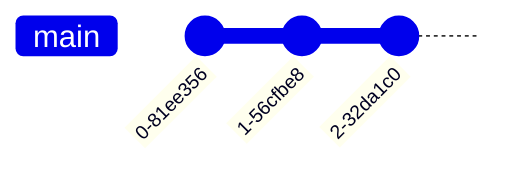

# Test C4

![context](data:image/svg+xml;base64,PD94bWwgdmVyc2lvbj0iMS4wIiBlbmNvZGluZz0iVVRGLTgiIHN0YW5kYWxvbmU9Im5vIj8+PHN2ZyB4bWxucz0iaHR0cDovL3d3dy53My5vcmcvMjAwMC9zdmciIHhtbG5zOnhsaW5rPSJodHRwOi8vd3d3LnczLm9yZy8xOTk5L3hsaW5rIiBjb250ZW50U3R5bGVUeXBlPSJ0ZXh0L2NzcyIgaGVpZ2h0PSI3MTZweCIgcHJlc2VydmVBc3BlY3RSYXRpbz0ibm9uZSIgc3R5bGU9IndpZHRoOjQ0OHB4O2hlaWdodDo3MTZweDtiYWNrZ3JvdW5kOiNGRkZGRkY7IiB2ZXJzaW9uPSIxLjEiIHZpZXdCb3g9IjAgMCA0NDggNzE2IiB3aWR0aD0iNDQ4cHgiIHpvb21BbmRQYW49Im1hZ25pZnkiPjxkZWZzLz48Zz48IS0tTUQ1PVswNTU4ODBjNWRkZmZkYTBmODRhNDkwMWNkYzM1ZDY3ZV0KZW50aXR5IHBiYy0tPjxnIGlkPSJlbGVtX3BiYyI+PHJlY3QgZmlsbD0iIzA4NDI3QiIgaGVpZ2h0PSIxNTUuMTUyMyIgcng9IjIuNSIgcnk9IjIuNSIgc3R5bGU9InN0cm9rZTojMDczQjZGO3N0cm9rZS13aWR0aDowLjU7IiB3aWR0aD0iMjIwIiB4PSIxNDYuNSIgeT0iNyIvPjxpbWFnZSBoZWlnaHQ9IjQ4IiB3aWR0aD0iNDgiIHg9IjIzMi41IiB4bGluazpocmVmPSJkYXRhOmltYWdlL3BuZztiYXNlNjQsaVZCT1J3MEtHZ29BQUFBTlNVaEVVZ0FBQURBQUFBQXdDQUlBQUFEWVlHN1FBQUFDRDBsRVFWUjRYdTJZb1U0RU1SQ0dUKzRqOEFpOEFoYUg0UUhnQVVqUXVGTUVDVWdNSVVnd0pBZ01oZ1FzQVlVaUpDaVFJQkJZK0VJVHNqZlRkbWU2VjI0djRjOHZ5R2JiK1pqT3ROMGJOY3ZqUVhta0g4M1d2WUJXdG82UExtNnY3cDd1SDEvdzJmWEQrUEJ5Y1gxUHYybDNJZERtL3ZuN3grZFhRaUF1YlJ6b1VSYTdnUlpXZDBpR1JJaUpiT25obmZZQlFaTkpqTmJ1eVkyZUpHOGZrREUzYmJHNGVwNk1IVUFzZ1l4bUUzblZzNlZzQldKU0djY3NPbEZQbUxJVmlNekxPQjdwQ1ZPMkF0SEpNb2hIN0ZoNnpxaXRRSzdtMHJKdkFWWWdHY0VwZS8vUExkRHo2NXNNNHBGOU43SUNjWERLSUI1TnY2ajd0RDBOb1NkTTJRclU5R2cwZXdFMUxxQmhIUjNCQmR2ajJ2YXBuaWRqSHhEL3E2dmQ3UHZocjMxQXdjWThlWE1UWEFLRUNaWkpGWHVFcTI3YUxnUUs1dUxNb2hDZW5HR3VHZXdPeFNqQnZZQnFlRzZCK05xaWJsZ2dkam5jK1pYRHkrRk5GcEZ6dzc2TzNVQkFST3VYaDZGb2lBY2Y1ZzllVHZVZ3p5MG5XZzZJOGNYSFJVcGc1Yk9WQkNvK0tEcEZhak9mMjNHZ1BtZTdSU1ErbGFjSUVOVWdKNmdnMWs2SGpnT2xxbkxxaXA0dEV1aHYwaE5FTVhVRDBjbHlYRTNwNnBaQTBTMm5udlRsWHdMSkVaV2xiN2NUUUgxK1VTZ1RONFZoQWVubS93ZWExT0NBT21xbzZmRTFXQ2I5V1NLQmFoK3JiVVdQV0FtRTJSdmswQXBpQjQ1ZU95TkF6VTh4Y1R2ajhLdmtLRW9PYUlZZUhOQTNadXlnQXZGTVVPMEFBQUFBU1VWT1JLNUNZSUk9IiB5PSIxNyIvPjx0ZXh0IGZpbGw9IiNGRkZGRkYiIGZvbnQtZmFtaWx5PSJzYW5zLXNlcmlmIiBmb250LXNpemU9IjE2IiBmb250LXdlaWdodD0iYm9sZCIgbGVuZ3RoQWRqdXN0PSJzcGFjaW5nIiB0ZXh0TGVuZ3RoPSIxNDIiIHg9IjE4MyIgeT0iODAuNDY4OCI+UGVyc29uYWwgQmFua2luZzwvdGV4dD48dGV4dCBmaWxsPSIjRkZGRkZGIiBmb250LWZhbWlseT0ic2Fucy1zZXJpZiIgZm9udC1zaXplPSIxNiIgZm9udC13ZWlnaHQ9ImJvbGQiIGxlbmd0aEFkanVzdD0ic3BhY2luZyIgdGV4dExlbmd0aD0iNzkiIHg9IjIxNyIgeT0iOTkuMzEyNSI+Q3VzdG9tZXI8L3RleHQ+PHRleHQgZmlsbD0iI0ZGRkZGRiIgZm9udC1mYW1pbHk9InNhbnMtc2VyaWYiIGZvbnQtc2l6ZT0iMTQiIGxlbmd0aEFkanVzdD0ic3BhY2luZyIgdGV4dExlbmd0aD0iNCIgeD0iMjU0LjUiIHk9IjExNi4yMjI3Ij7CoDwvdGV4dD48dGV4dCBmaWxsPSIjRkZGRkZGIiBmb250LWZhbWlseT0ic2Fucy1zZXJpZiIgZm9udC1zaXplPSIxNCIgbGVuZ3RoQWRqdXN0PSJzcGFjaW5nIiB0ZXh0TGVuZ3RoPSIxNjQiIHg9IjE3NC41IiB5PSIxMzIuNzEwOSI+QSBjdXN0b21lciBvZiB0aGUgYmFuayw8L3RleHQ+PHRleHQgZmlsbD0iI0ZGRkZGRiIgZm9udC1mYW1pbHk9InNhbnMtc2VyaWYiIGZvbnQtc2l6ZT0iMTQiIGxlbmd0aEFkanVzdD0ic3BhY2luZyIgdGV4dExlbmd0aD0iMjAwIiB4PSIxNTYuNSIgeT0iMTQ5LjE5OTIiPndpdGggcGVyc29uYWwgYmFuayBhY2NvdW50cy48L3RleHQ+PC9nPjwhLS1NRDU9W2MzYTVmNTU3NmY0MTUyMTJjNTk5YTAzNmRiMjk5ODgwXQplbnRpdHkgaWJzLS0+PGcgaWQ9ImVsZW1faWJzIj48cmVjdCBmaWxsPSIjMTE2OEJEIiBoZWlnaHQ9IjEyMS4yODUyIiByeD0iMi41IiByeT0iMi41IiBzdHlsZT0ic3Ryb2tlOiMzQzdGQzA7c3Ryb2tlLXdpZHRoOjAuNTsiIHdpZHRoPSIyMTkiIHg9IjU3IiB5PSIyMzgiLz48dGV4dCBmaWxsPSIjRkZGRkZGIiBmb250LWZhbWlseT0ic2Fucy1zZXJpZiIgZm9udC1zaXplPSIxNiIgZm9udC13ZWlnaHQ9ImJvbGQiIGxlbmd0aEFkanVzdD0ic3BhY2luZyIgdGV4dExlbmd0aD0iMTk5IiB4PSI2NyIgeT0iMjYzLjQ2ODgiPkludGVybmV0IEJhbmtpbmcgU3lzdGVtPC90ZXh0Pjx0ZXh0IGZpbGw9IiNGRkZGRkYiIGZvbnQtZmFtaWx5PSJzYW5zLXNlcmlmIiBmb250LXNpemU9IjE0IiBsZW5ndGhBZGp1c3Q9InNwYWNpbmciIHRleHRMZW5ndGg9IjQiIHg9IjE2NC41IiB5PSIyODAuMzc4OSI+wqA8L3RleHQ+PHRleHQgZmlsbD0iI0ZGRkZGRiIgZm9udC1mYW1pbHk9InNhbnMtc2VyaWYiIGZvbnQtc2l6ZT0iMTQiIGxlbmd0aEFkanVzdD0ic3BhY2luZyIgdGV4dExlbmd0aD0iMTcyIiB4PSI4MC41IiB5PSIyOTYuODY3MiI+QWxsb3dzIGN1c3RvbWVycyB0byB2aWV3PC90ZXh0Pjx0ZXh0IGZpbGw9IiNGRkZGRkYiIGZvbnQtZmFtaWx5PSJzYW5zLXNlcmlmIiBmb250LXNpemU9IjE0IiBsZW5ndGhBZGp1c3Q9InNwYWNpbmciIHRleHRMZW5ndGg9IjE5OSIgeD0iNjciIHk9IjMxMy4zNTU1Ij5pbmZvcm1hdGlvbiBhYm91dCB0aGVpciBiYW5rPC90ZXh0Pjx0ZXh0IGZpbGw9IiNGRkZGRkYiIGZvbnQtZmFtaWx5PSJzYW5zLXNlcmlmIiBmb250LXNpemU9IjE0IiBsZW5ndGhBZGp1c3Q9InNwYWNpbmciIHRleHRMZW5ndGg9IjEzNiIgeD0iOTYuNSIgeT0iMzI5Ljg0MzgiPmFjY291bnRzLCBhbmQgbWFrZTwvdGV4dD48dGV4dCBmaWxsPSIjRkZGRkZGIiBmb250LWZhbWlseT0ic2Fucy1zZXJpZiIgZm9udC1zaXplPSIxNCIgbGVuZ3RoQWRqdXN0PSJzcGFjaW5nIiB0ZXh0TGVuZ3RoPSI3MCIgeD0iMTMxLjUiIHk9IjM0Ni4zMzIiPnBheW1lbnRzLjwvdGV4dD48L2c+PCEtLU1ENT1bZGVkNmE2OTIxMGZiYmM3OTYxZGVlN2I3NzMyMzIyNjddCmVudGl0eSBlcy0tPjxnIGlkPSJlbGVtX2VzIj48cmVjdCBmaWxsPSIjOTk5OTk5IiBoZWlnaHQ9Ijg4LjMwODYiIHJ4PSIyLjUiIHJ5PSIyLjUiIHN0eWxlPSJzdHJva2U6IzhBOEE4QTtzdHJva2Utd2lkdGg6MC41OyIgd2lkdGg9IjE5MSIgeD0iMjUxIiB5PSI0NzUiLz48dGV4dCBmaWxsPSIjRkZGRkZGIiBmb250LWZhbWlseT0ic2Fucy1zZXJpZiIgZm9udC1zaXplPSIxNiIgZm9udC13ZWlnaHQ9ImJvbGQiIGxlbmd0aEFkanVzdD0ic3BhY2luZyIgdGV4dExlbmd0aD0iMTE4IiB4PSIyODcuNSIgeT0iNTAwLjQ2ODgiPkUtbWFpbCBzeXN0ZW08L3RleHQ+PHRleHQgZmlsbD0iI0ZGRkZGRiIgZm9udC1mYW1pbHk9InNhbnMtc2VyaWYiIGZvbnQtc2l6ZT0iMTQiIGxlbmd0aEFkanVzdD0ic3BhY2luZyIgdGV4dExlbmd0aD0iNCIgeD0iMzQ0LjUiIHk9IjUxNy4zNzg5Ij7CoDwvdGV4dD48dGV4dCBmaWxsPSIjRkZGRkZGIiBmb250LWZhbWlseT0ic2Fucy1zZXJpZiIgZm9udC1zaXplPSIxNCIgbGVuZ3RoQWRqdXN0PSJzcGFjaW5nIiB0ZXh0TGVuZ3RoPSIxNTEiIHg9IjI3MSIgeT0iNTMzLjg2NzIiPlRoZSBpbnRlcm5hbCBNaWNyb3NvZnQ8L3RleHQ+PHRleHQgZmlsbD0iI0ZGRkZGRiIgZm9udC1mYW1pbHk9InNhbnMtc2VyaWYiIGZvbnQtc2l6ZT0iMTQiIGxlbmd0aEFkanVzdD0ic3BhY2luZyIgdGV4dExlbmd0aD0iMTcxIiB4PSIyNjEiIHk9IjU1MC4zNTU1Ij5FeGNoYW5nZSBlLW1haWwgc3lzdGVtLjwvdGV4dD48L2c+PCEtLU1ENT1bY2FmODNmMzZkMzYyMGI1ZGIyODM2NmJkN2QyNDk3NTFdCmVudGl0eSBtYnMtLT48ZyBpZD0iZWxlbV9tYnMiPjxyZWN0IGZpbGw9IiM5OTk5OTkiIGhlaWdodD0iMTQwLjEyODkiIHJ4PSIyLjUiIHJ5PSIyLjUiIHN0eWxlPSJzdHJva2U6IzhBOEE4QTtzdHJva2Utd2lkdGg6MC41OyIgd2lkdGg9IjIwOSIgeD0iNyIgeT0iNDQ5Ii8+PHRleHQgZmlsbD0iI0ZGRkZGRiIgZm9udC1mYW1pbHk9InNhbnMtc2VyaWYiIGZvbnQtc2l6ZT0iMTYiIGZvbnQtd2VpZ2h0PSJib2xkIiBsZW5ndGhBZGp1c3Q9InNwYWNpbmciIHRleHRMZW5ndGg9IjE2MCIgeD0iMjkiIHk9IjQ3NC40Njg4Ij5NYWluZnJhbWUgQmFua2luZzwvdGV4dD48dGV4dCBmaWxsPSIjRkZGRkZGIiBmb250LWZhbWlseT0ic2Fucy1zZXJpZiIgZm9udC1zaXplPSIxNiIgZm9udC13ZWlnaHQ9ImJvbGQiIGxlbmd0aEFkanVzdD0ic3BhY2luZyIgdGV4dExlbmd0aD0iNTgiIHg9IjgyLjUiIHk9IjQ5My4zMTI1Ij5TeXN0ZW08L3RleHQ+PHRleHQgZmlsbD0iI0ZGRkZGRiIgZm9udC1mYW1pbHk9InNhbnMtc2VyaWYiIGZvbnQtc2l6ZT0iMTQiIGxlbmd0aEFkanVzdD0ic3BhY2luZyIgdGV4dExlbmd0aD0iNCIgeD0iMTA5LjUiIHk9IjUxMC4yMjI3Ij7CoDwvdGV4dD48dGV4dCBmaWxsPSIjRkZGRkZGIiBmb250LWZhbWlseT0ic2Fucy1zZXJpZiIgZm9udC1zaXplPSIxNCIgbGVuZ3RoQWRqdXN0PSJzcGFjaW5nIiB0ZXh0TGVuZ3RoPSIxNDEiIHg9IjQxIiB5PSI1MjYuNzEwOSI+U3RvcmVzIGFsbCBvZiB0aGUgY29yZTwvdGV4dD48dGV4dCBmaWxsPSIjRkZGRkZGIiBmb250LWZhbWlseT0ic2Fucy1zZXJpZiIgZm9udC1zaXplPSIxNCIgbGVuZ3RoQWRqdXN0PSJzcGFjaW5nIiB0ZXh0TGVuZ3RoPSIxODUiIHg9IjE3IiB5PSI1NDMuMTk5MiI+YmFua2luZyBpbmZvcm1hdGlvbiBhYm91dDwvdGV4dD48dGV4dCBmaWxsPSIjRkZGRkZGIiBmb250LWZhbWlseT0ic2Fucy1zZXJpZiIgZm9udC1zaXplPSIxNCIgbGVuZ3RoQWRqdXN0PSJzcGFjaW5nIiB0ZXh0TGVuZ3RoPSIxNDQiIHg9IjM3LjUiIHk9IjU1OS42ODc1Ij5jdXN0b21lcnMsIGFjY291bnRzLDwvdGV4dD48dGV4dCBmaWxsPSIjRkZGRkZGIiBmb250LWZhbWlseT0ic2Fucy1zZXJpZiIgZm9udC1zaXplPSIxNCIgbGVuZ3RoQWRqdXN0PSJzcGFjaW5nIiB0ZXh0TGVuZ3RoPSIxMTYiIHg9IjUzLjUiIHk9IjU3Ni4xNzU4Ij50cmFuc2FjdGlvbnMsIGV0Yy48L3RleHQ+PC9nPjwhLS1NRDU9Wzk4ZTAxYTcyMzRlODU3NzBhNDU2OTY4ZjcxZTZjNWU5XQpsaW5rIHBiYyB0byBpYnMtLT48ZyBpZD0ibGlua19wYmNfaWJzIj48cGF0aCBkPSJNMjIzLjg4LDE2Mi4zNCBDMjE0LjY0LDE4NC4xIDIwNC42NCwyMDcuNjUgMTk1LjYyLDIyOC45ICIgZmlsbD0ibm9uZSIgaWQ9InBiYy10by1pYnMiIHN0eWxlPSJzdHJva2U6IzY2NjY2NjtzdHJva2Utd2lkdGg6MS4wOyIvPjxwb2x5Z29uIGZpbGw9IiM2NjY2NjYiIHBvaW50cz0iMTkyLjU1LDIzNi4xNCwxOTguNDMxMiwyMjkuOTQyMywxOTIuOTA1OCwyMjcuNjAzNCwxOTIuNTUsMjM2LjE0IiBzdHlsZT0ic3Ryb2tlOiM2NjY2NjY7c3Ryb2tlLXdpZHRoOjEuMDsiLz48dGV4dCBmaWxsPSIjNjY2NjY2IiBmb250LWZhbWlseT0ic2Fucy1zZXJpZiIgZm9udC1zaXplPSIxMiIgZm9udC13ZWlnaHQ9ImJvbGQiIGxlbmd0aEFkanVzdD0ic3BhY2luZyIgdGV4dExlbmd0aD0iMzAiIHg9IjIwOS41IiB5PSIyMDQuNjAxNiI+VXNlczwvdGV4dD48L2c+PCEtLU1ENT1bOGI3NjkzYTIwZDQxYzJhMWZhMjdkOWY2YTk2ZWMzYjZdCmxpbmsgZXMgdG8gcGJjLS0+PGcgaWQ9ImxpbmtfZXNfcGJjIj48cGF0aCBkPSJNMzM5LjQ4LDQ3NC42NCBDMzM1LjMzLDQ0OS41OCAzMjkuODUsNDE3LjQ3IDMyNC41LDM4OSBDMzExLjg1LDMyMS42NyAzMDguNDcsMzA0Ljg2IDI5My41LDIzOCBDMjg4LjY2LDIxNi4zNyAyODMuMTUsMTkzLjA4IDI3Ny45LDE3MS4zNyAiIGZpbGw9Im5vbmUiIGlkPSJlcy10by1wYmMiIHN0eWxlPSJzdHJva2U6IzY2NjY2NjtzdHJva2Utd2lkdGg6MS4wOyIvPjxwb2x5Z29uIGZpbGw9IiM2NjY2NjYiIHBvaW50cz0iMjc2LjAyLDE2My42NCwyNzQuOTkxLDE3Mi4xMjE4LDI4MC44MjE4LDE3MC43MDcsMjc2LjAyLDE2My42NCIgc3R5bGU9InN0cm9rZTojNjY2NjY2O3N0cm9rZS13aWR0aDoxLjA7Ii8+PHRleHQgZmlsbD0iIzY2NjY2NiIgZm9udC1mYW1pbHk9InNhbnMtc2VyaWYiIGZvbnQtc2l6ZT0iMTIiIGZvbnQtd2VpZ2h0PSJib2xkIiBsZW5ndGhBZGp1c3Q9InNwYWNpbmciIHRleHRMZW5ndGg9IjEwNyIgeD0iMzE5LjUiIHk9IjMwMy4xMDE2Ij5TZW5kcyBlLW1haWxzIHRvPC90ZXh0PjwvZz48IS0tTUQ1PVswZWM5YTYxZjc5MjEwYmM4MDkzMmQzMGE0NTJlMDAxOV0KbGluayBpYnMgdG8gZXMtLT48ZyBpZD0ibGlua19pYnNfZXMiPjxwYXRoIGQ9Ik0xOTEuODMsMzU5LjQ1IEMyMDEuNzMsMzc5LjQzIDIxNC4xNyw0MDEuMTMgMjI4LjUsNDE5IEMyNDIuOSw0MzYuOTYgMjYwLjk1LDQ1NC4wMyAyNzguNTgsNDY4Ljc5ICIgZmlsbD0ibm9uZSIgaWQ9Imlicy10by1lcyIgc3R5bGU9InN0cm9rZTojNjY2NjY2O3N0cm9rZS13aWR0aDoxLjA7Ii8+PHBvbHlnb24gZmlsbD0iIzY2NjY2NiIgcG9pbnRzPSIyODQuMzksNDczLjU4LDI4MC4xMTU3LDQ2Ni4xODIsMjc2LjMwNTIsNDcwLjgxNjcsMjg0LjM5LDQ3My41OCIgc3R5bGU9InN0cm9rZTojNjY2NjY2O3N0cm9rZS13aWR0aDoxLjA7Ii8+PHRleHQgZmlsbD0iIzY2NjY2NiIgZm9udC1mYW1pbHk9InNhbnMtc2VyaWYiIGZvbnQtc2l6ZT0iMTIiIGZvbnQtd2VpZ2h0PSJib2xkIiBsZW5ndGhBZGp1c3Q9InNwYWNpbmciIHRleHRMZW5ndGg9IjkwIiB4PSIyMjkuNSIgeT0iNDAxLjYwMTYiPlNlbmRzIGUtbWFpbHM8L3RleHQ+PHRleHQgZmlsbD0iIzY2NjY2NiIgZm9udC1mYW1pbHk9InNhbnMtc2VyaWYiIGZvbnQtc2l6ZT0iMTIiIGZvbnQtc3R5bGU9Iml0YWxpYyIgbGVuZ3RoQWRqdXN0PSJzcGFjaW5nIiB0ZXh0TGVuZ3RoPSIzOSIgeD0iMjU1IiB5PSI0MTUuNzM0NCI+W1NNVFBdPC90ZXh0PjwvZz48IS0tTUQ1PVthMzdhZjY2MWY5NWJmNGY3OWNhYTViMGQxOTcyOGMyY10KbGluayBpYnMgdG8gbWJzLS0+PGcgaWQ9ImxpbmtfaWJzX21icyI+PHBhdGggZD0iTTE0MS45NSwzNTkuMTMgQzEzOC40MywzNjkgMTM1LjEzLDM3OS4yMSAxMzIuNSwzODkgQzEyOC4xNiw0MDUuMTggMTI0LjU3LDQyMi43NiAxMjEuNjcsNDM5LjU4ICIgZmlsbD0ibm9uZSIgaWQ9Imlicy10by1tYnMiIHN0eWxlPSJzdHJva2U6IzY2NjY2NjtzdHJva2Utd2lkdGg6MS4wOyIvPjxwb2x5Z29uIGZpbGw9IiM2NjY2NjYiIHBvaW50cz0iMTIwLjM4LDQ0Ny4zNCwxMjQuNjU0NCw0MzkuOTQyLDExOC43MzYsNDM4Ljk1NTcsMTIwLjM4LDQ0Ny4zNCIgc3R5bGU9InN0cm9rZTojNjY2NjY2O3N0cm9rZS13aWR0aDoxLjA7Ii8+PHRleHQgZmlsbD0iIzY2NjY2NiIgZm9udC1mYW1pbHk9InNhbnMtc2VyaWYiIGZvbnQtc2l6ZT0iMTIiIGZvbnQtd2VpZ2h0PSJib2xkIiBsZW5ndGhBZGp1c3Q9InNwYWNpbmciIHRleHRMZW5ndGg9IjMwIiB4PSIxMzMuNSIgeT0iNDA4LjYwMTYiPlVzZXM8L3RleHQ+PC9nPjxyZWN0IGhlaWdodD0iOTguNDQxNCIgcng9IjcuNSIgcnk9IjcuNSIgc3R5bGU9InN0cm9rZTojMDAwMDAwMDA7c3Ryb2tlLXdpZHRoOjEuMDtmaWxsOm5vbmU7IiB3aWR0aD0iMTI5IiB4PSIyOTciIHk9IjYwMi4xMjg5Ii8+PHRleHQgZmlsbD0iIzAwMDAwMCIgZm9udC1mYW1pbHk9InNhbnMtc2VyaWYiIGZvbnQtc2l6ZT0iMTQiIGZvbnQtd2VpZ2h0PSJib2xkIiBsZW5ndGhBZGp1c3Q9InNwYWNpbmciIHRleHRMZW5ndGg9IjUxIiB4PSIzMDMiIHk9IjYyMy42NjQxIj5MZWdlbmQ8L3RleHQ+PHRleHQgZmlsbD0iI0ZGRkZGRiIgZm9udC1mYW1pbHk9InNhbnMtc2VyaWYiIGZvbnQtc2l6ZT0iMTQiIGxlbmd0aEFkanVzdD0ic3BhY2luZyIgdGV4dExlbmd0aD0iNCIgeD0iMzU0IiB5PSI2MjMuNjY0MSI+wqA8L3RleHQ+PHJlY3QgZmlsbD0iIzA4NDI3QiIgaGVpZ2h0PSIxNi40ODgzIiBzdHlsZT0ic3Ryb2tlOm5vbmU7c3Ryb2tlLXdpZHRoOjEuMDsiIHdpZHRoPSIxMTciIHg9IjMwMyIgeT0iNjI2LjYxNzIiLz48dGV4dCBmaWxsPSIjRkZGRkZGIiBmb250LWZhbWlseT0ic2Fucy1zZXJpZiIgZm9udC1zaXplPSIxNCIgbGVuZ3RoQWRqdXN0PSJzcGFjaW5nIiB0ZXh0TGVuZ3RoPSI0OCIgeD0iMzA3IiB5PSI2NDAuMTUyMyI+cGVyc29uPC90ZXh0PjxyZWN0IGZpbGw9IiMxMTY4QkQiIGhlaWdodD0iMTYuNDg4MyIgc3R5bGU9InN0cm9rZTpub25lO3N0cm9rZS13aWR0aDoxLjA7IiB3aWR0aD0iMTE3IiB4PSIzMDMiIHk9IjY0My4xMDU1Ii8+PHRleHQgZmlsbD0iI0ZGRkZGRiIgZm9udC1mYW1pbHk9InNhbnMtc2VyaWYiIGZvbnQtc2l6ZT0iMTQiIGxlbmd0aEFkanVzdD0ic3BhY2luZyIgdGV4dExlbmd0aD0iNDciIHg9IjMwNyIgeT0iNjU2LjY0MDYiPnN5c3RlbTwvdGV4dD48cmVjdCBmaWxsPSIjNjg2ODY4IiBoZWlnaHQ9IjE2LjQ4ODMiIHN0eWxlPSJzdHJva2U6bm9uZTtzdHJva2Utd2lkdGg6MS4wOyIgd2lkdGg9IjExNyIgeD0iMzAzIiB5PSI2NTkuNTkzOCIvPjx0ZXh0IGZpbGw9IiNGRkZGRkYiIGZvbnQtZmFtaWx5PSJzYW5zLXNlcmlmIiBmb250LXNpemU9IjE0IiBsZW5ndGhBZGp1c3Q9InNwYWNpbmciIHRleHRMZW5ndGg9IjEwOSIgeD0iMzA3IiB5PSI2NzMuMTI4OSI+ZXh0ZXJuYWwgcGVyc29uPC90ZXh0PjxyZWN0IGZpbGw9IiM5OTk5OTkiIGhlaWdodD0iMTYuNDg4MyIgc3R5bGU9InN0cm9rZTpub25lO3N0cm9rZS13aWR0aDoxLjA7IiB3aWR0aD0iMTE3IiB4PSIzMDMiIHk9IjY3Ni4wODIiLz48dGV4dCBmaWxsPSIjRkZGRkZGIiBmb250LWZhbWlseT0ic2Fucy1zZXJpZiIgZm9udC1zaXplPSIxNCIgbGVuZ3RoQWRqdXN0PSJzcGFjaW5nIiB0ZXh0TGVuZ3RoPSIxMDgiIHg9IjMwNyIgeT0iNjg5LjYxNzIiPmV4dGVybmFsIHN5c3RlbTwvdGV4dD48bGluZSBzdHlsZT0ic3Ryb2tlOiNGRkZGRkY7c3Ryb2tlLXdpZHRoOjEuMDsiIHgxPSIzMDMiIHgyPSI0MjAiIHkxPSI2MTAuMTI4OSIgeTI9IjYxMC4xMjg5Ii8+PGxpbmUgc3R5bGU9InN0cm9rZTojRkZGRkZGO3N0cm9rZS13aWR0aDoxLjA7IiB4MT0iMzAzIiB4Mj0iNDIwIiB5MT0iNjI2LjYxNzIiIHkyPSI2MjYuNjE3MiIvPjxsaW5lIHN0eWxlPSJzdHJva2U6I0ZGRkZGRjtzdHJva2Utd2lkdGg6MS4wOyIgeDE9IjMwMyIgeDI9IjQyMCIgeTE9IjY0My4xMDU1IiB5Mj0iNjQzLjEwNTUiLz48bGluZSBzdHlsZT0ic3Ryb2tlOiNGRkZGRkY7c3Ryb2tlLXdpZHRoOjEuMDsiIHgxPSIzMDMiIHgyPSI0MjAiIHkxPSI2NTkuNTkzOCIgeTI9IjY1OS41OTM4Ii8+PGxpbmUgc3R5bGU9InN0cm9rZTojRkZGRkZGO3N0cm9rZS13aWR0aDoxLjA7IiB4MT0iMzAzIiB4Mj0iNDIwIiB5MT0iNjc2LjA4MiIgeTI9IjY3Ni4wODIiLz48bGluZSBzdHlsZT0ic3Ryb2tlOiNGRkZGRkY7c3Ryb2tlLXdpZHRoOjEuMDsiIHgxPSIzMDMiIHgyPSI0MjAiIHkxPSI2OTIuNTcwMyIgeTI9IjY5Mi41NzAzIi8+PGxpbmUgc3R5bGU9InN0cm9rZTojRkZGRkZGO3N0cm9rZS13aWR0aDoxLjA7IiB4MT0iMzAzIiB4Mj0iMzAzIiB5MT0iNjEwLjEyODkiIHkyPSI2OTIuNTcwMyIvPjxsaW5lIHN0eWxlPSJzdHJva2U6I0ZGRkZGRjtzdHJva2Utd2lkdGg6MS4wOyIgeDE9IjQyMCIgeDI9IjQyMCIgeTE9IjYxMC4xMjg5IiB5Mj0iNjkyLjU3MDMiLz48IS0tTUQ1PVswZjZlZmQ3YjA3ZmQ3YzkyMmNmY2ZiZTgxZTJkY2Q4ZV0KQHN0YXJ0dW1sDQohaW5jbHVkZSBodHRwczovL3Jhdy5naXRodWJ1c2VyY29udGVudC5jb20vYWRyaWFudmx1cHUvQzQtUGxhbnRVTUwvbGF0ZXN0L0M0X0NvbnRleHQucHVtbA0KDQpMQVlPVVRfV0lUSF9MRUdFTkQoKQ0KDQpQZXJzb24ocGJjLCAiUGVyc29uYWwgQmFua2luZyBDdXN0b21lciIsICJBIGN1c3RvbWVyIG9mIHRoZSBiYW5rLCB3aXRoIHBlcnNvbmFsIGJhbmsgYWNjb3VudHMuIikNClN5c3RlbShpYnMsICJJbnRlcm5ldCBCYW5raW5nIFN5c3RlbSIsICJBbGxvd3MgY3VzdG9tZXJzIHRvIHZpZXcgaW5mb3JtYXRpb24gYWJvdXQgdGhlaXIgYmFuayBhY2NvdW50cywgYW5kIG1ha2UgcGF5bWVudHMuIikNClN5c3RlbV9FeHQoZXMsICJFLW1haWwgc3lzdGVtIiwgIlRoZSBpbnRlcm5hbCBNaWNyb3NvZnQgRXhjaGFuZ2UgZS1tYWlsIHN5c3RlbS4iKQ0KU3lzdGVtX0V4dChtYnMsICJNYWluZnJhbWUgQmFua2luZyBTeXN0ZW0iLCAiU3RvcmVzIGFsbCBvZiB0aGUgY29yZSBiYW5raW5nIGluZm9ybWF0aW9uIGFib3V0IGN1c3RvbWVycywgYWNjb3VudHMsIHRyYW5zYWN0aW9ucywgZXRjLiIpDQoNClJlbChwYmMsIGlicywgIlVzZXMiKQ0KUmVsKGVzLCBwYmMsICJTZW5kcyBlLW1haWxzIHRvIikNClJlbChpYnMsIGVzLCAiU2VuZHMgZS1tYWlscyIsICJTTVRQIikNClJlbChpYnMsIG1icywgIlVzZXMiKQ0KQGVuZHVtbA0KCkBzdGFydHVtbA0KDQoNCg0KDQoNCnNraW5wYXJhbSBkZWZhdWx0VGV4dEFsaWdubWVudCBjZW50ZXINCg0Kc2tpbnBhcmFtIHdyYXBXaWR0aCAyMDANCnNraW5wYXJhbSBtYXhNZXNzYWdlU2l6ZSAxNTANCg0Kc2tpbnBhcmFtIExlZ2VuZEJvcmRlckNvbG9yIHRyYW5zcGFyZW50DQpza2lucGFyYW0gTGVnZW5kQmFja2dyb3VuZENvbG9yIHRyYW5zcGFyZW50DQpza2lucGFyYW0gTGVnZW5kRm9udENvbG9yICNGRkZGRkYNCg0Kc2tpbnBhcmFtIHJlY3RhbmdsZSB7DQogICAgU3RlcmVvdHlwZUZvbnRTaXplIDEyDQogICAgc2hhZG93aW5nIGZhbHNlDQp9DQoNCnNraW5wYXJhbSBkYXRhYmFzZSB7DQogICAgU3RlcmVvdHlwZUZvbnRTaXplIDEyDQogICAgc2hhZG93aW5nIGZhbHNlDQp9DQoNCnNraW5wYXJhbSBxdWV1ZSB7DQogICAgU3RlcmVvdHlwZUZvbnRTaXplIDEyDQogICAgc2hhZG93aW5nIGZhbHNlDQp9DQoNCnNraW5wYXJhbSBBcnJvdyB7DQogICAgQ29sb3IgIzY2NjY2Ng0KICAgIEZvbnRDb2xvciAjNjY2NjY2DQogICAgRm9udFNpemUgMTINCn0NCg0Kc2tpbnBhcmFtIHJlY3RhbmdsZTw8Ym91bmRhcnk+PiB7DQogICAgU2hhZG93aW5nIGZhbHNlDQogICAgU3RlcmVvdHlwZUZvbnRTaXplIDANCiAgICBGb250Q29sb3IgIzQ0NDQ0NA0KICAgIEJvcmRlckNvbG9yICM0NDQ0NDQNCiAgICBCb3JkZXJTdHlsZSBkYXNoZWQNCn0NCg0KDQoNCg0KDQoNCg0KDQoNCg0KDQoNCg0KDQoNCg0KDQoNCg0KDQoNCg0KDQoNCg0KDQoNCg0KDQpza2lucGFyYW0gcmVjdGFuZ2xlPDxwZXJzb24+PiB7DQogICAgU3RlcmVvdHlwZUZvbnRDb2xvciAjRkZGRkZGDQogICAgRm9udENvbG9yICNGRkZGRkYNCiAgICBCYWNrZ3JvdW5kQ29sb3IgIzA4NDI3Qg0KICAgIEJvcmRlckNvbG9yICMwNzNCNkYNCn0NCg0Kc2tpbnBhcmFtIHJlY3RhbmdsZTw8ZXh0ZXJuYWxfcGVyc29uPj4gew0KICAgIFN0ZXJlb3R5cGVGb250Q29sb3IgI0ZGRkZGRg0KICAgIEZvbnRDb2xvciAjRkZGRkZGDQogICAgQmFja2dyb3VuZENvbG9yICM2ODY4NjgNCiAgICBCb3JkZXJDb2xvciAjOEE4QThBDQp9DQoNCnNraW5wYXJhbSByZWN0YW5nbGU8PHN5c3RlbT4+IHsNCiAgICBTdGVyZW90eXBlRm9udENvbG9yICNGRkZGRkYNCiAgICBGb250Q29sb3IgI0ZGRkZGRg0KICAgIEJhY2tncm91bmRDb2xvciAjMTE2OEJEDQogICAgQm9yZGVyQ29sb3IgIzNDN0ZDMA0KfQ0KDQpza2lucGFyYW0gcmVjdGFuZ2xlPDxleHRlcm5hbF9zeXN0ZW0+PiB7DQogICAgU3RlcmVvdHlwZUZvbnRDb2xvciAjRkZGRkZGDQogICAgRm9udENvbG9yICNGRkZGRkYNCiAgICBCYWNrZ3JvdW5kQ29sb3IgIzk5OTk5OQ0KICAgIEJvcmRlckNvbG9yICM4QThBOEENCn0NCg0Kc3ByaXRlICRwZXJzb24gWzQ4eDQ4LzE2XSB7DQowMDAwMDAwMDAwMDAwMDAwMDAwMDAwMDAwMDAwMDAwMDAwMDAwMDAwMDAwMDAwMDANCjAwMDAwMDAwMDAwMDAwMDAwMDAwMDAwMDAwMDAwMDAwMDAwMDAwMDAwMDAwMDAwMA0KMDAwMDAwMDAwMDAwMDAwMDAwMDA0OUJDQ0E3MjAwMDAwMDAwMDAwMDAwMDAwMDAwDQowMDAwMDAwMDAwMDAwMDAwMDA2RUZGRkZGRkZGQjMwMDAwMDAwMDAwMDAwMDAwMDANCjAwMDAwMDAwMDAwMDAwMDAxQ0ZGRkZGRkZGRkZGRjcwMDAwMDAwMDAwMDAwMDAwMA0KMDAwMDAwMDAwMDAwMDAwMUVGRkZGRkZGRkZGRkZGRjgwMDAwMDAwMDAwMDAwMDAwDQowMDAwMDAwMDAwMDAwMDBDRkZGRkZGRkZGRkZGRkZGRjYwMDAwMDAwMDAwMDAwMDANCjAwMDAwMDAwMDAwMDAwN0ZGRkZGRkZGRkZGRkZGRkZGRjEwMDAwMDAwMDAwMDAwMA0KMDAwMDAwMDAwMDAwMDFGRkZGRkZGRkZGRkZGRkZGRkZGOTAwMDAwMDAwMDAwMDAwDQowMDAwMDAwMDAwMDAwNkZGRkZGRkZGRkZGRkZGRkZGRkZGMDAwMDAwMDAwMDAwMDANCjAwMDAwMDAwMDAwMDBCRkZGRkZGRkZGRkZGRkZGRkZGRkY0MDAwMDAwMDAwMDAwMA0KMDAwMDAwMDAwMDAwMEVGRkZGRkZGRkZGRkZGRkZGRkZGRjcwMDAwMDAwMDAwMDAwDQowMDAwMDAwMDAwMDAwRkZGRkZGRkZGRkZGRkZGRkZGRkZGODAwMDAwMDAwMDAwMDANCjAwMDAwMDAwMDAwMDBGRkZGRkZGRkZGRkZGRkZGRkZGRkY4MDAwMDAwMDAwMDAwMA0KMDAwMDAwMDAwMDAwMERGRkZGRkZGRkZGRkZGRkZGRkZGRjYwMDAwMDAwMDAwMDAwDQowMDAwMDAwMDAwMDAwQUZGRkZGRkZGRkZGRkZGRkZGRkZGNDAwMDAwMDAwMDAwMDANCjAwMDAwMDAwMDAwMDA2RkZGRkZGRkZGRkZGRkZGRkZGRkUwMDAwMDAwMDAwMDAwMA0KMDAwMDAwMDAwMDAwMDBFRkZGRkZGRkZGRkZGRkZGRkZGODAwMDAwMDAwMDAwMDAwDQowMDAwMDAwMDAwMDAwMDdGRkZGRkZGRkZGRkZGRkZGRkYxMDAwMDAwMDAwMDAwMDANCjAwMDAwMDAwMDAwMDAwMEJGRkZGRkZGRkZGRkZGRkZGNTAwMDAwMDAwMDAwMDAwMA0KMDAwMDAwMDAwMDAwMDAwMURGRkZGRkZGRkZGRkZGRjcwMDAwMDAwMDAwMDAwMDAwDQowMDAwMDAwMDAwMDAwMDAwMEJGRkZGRkZGRkZGRkY1MDAwMDAwMDAwMDAwMDAwMDANCjAwMDAwMDAwMDAwMDAwMDAwMDVERkZGRkZGRkZBMTAwMDAwMDAwMDAwMDAwMDAwMA0KMDAwMDAwMDAwMDAwMDAwMDAwMDAzN0FCQjk2MTAwMDAwMDAwMDAwMDAwMDAwMDAwDQowMDAwMDAwMDAwMDAwMDAwMDAwMDAwMDAwMDAwMDAwMDAwMDAwMDAwMDAwMDAwMDANCjAwMDAwMDAwMDAwMDAwMDAwMDAwMDAwMDAwMDAwMDAwMDAwMDAwMDAwMDAwMDAwMA0KMDAwMDAwMDAwMDAwMDI1Nzg4MzAwMDAwMDAwMDA1ODg2NDEwMDAwMDAwMDAwMDAwDQowMDAwMDAwMDAwMDdERkZGRkZGRDk2NDMzNDdCRkZGRkZGRkI0MDAwMDAwMDAwMDANCjAwMDAwMDAwMDRFRkZGRkZGRkZGRkZGRkZGRkZGRkZGRkZGRkZCMTAwMDAwMDAwMA0KMDAwMDAwMDA3RkZGRkZGRkZGRkZGRkZGRkZGRkZGRkZGRkZGRkZEMjAwMDAwMDAwDQowMDAwMDAwNkZGRkZGRkZGRkZGRkZGRkZGRkZGRkZGRkZGRkZGRkZFMTAwMDAwMDANCjAwMDAwMDNGRkZGRkZGRkZGRkZGRkZGRkZGRkZGRkZGRkZGRkZGRkZCMDAwMDAwMA0KMDAwMDAwQkZGRkZGRkZGRkZGRkZGRkZGRkZGRkZGRkZGRkZGRkZGRkY1MDAwMDAwDQowMDAwMDNGRkZGRkZGRkZGRkZGRkZGRkZGRkZGRkZGRkZGRkZGRkZGRkQwMDAwMDANCjAwMDAwOUZGRkZGRkZGRkZGRkZGRkZGRkZGRkZGRkZGRkZGRkZGRkZGRjIwMDAwMA0KMDAwMDBERkZGRkZGRkZGRkZGRkZGRkZGRkZGRkZGRkZGRkZGRkZGRkZGNjAwMDAwDQowMDAwMEZGRkZGRkZGRkZGRkZGRkZGRkZGRkZGRkZGRkZGRkZGRkZGRkY4MDAwMDANCjAwMDAxRkZGRkZGRkZGRkZGRkZGRkZGRkZGRkZGRkZGRkZGRkZGRkZGRkEwMDAwMA0KMDAwMDFGRkZGRkZGRkZGRkZGRkZGRkZGRkZGRkZGRkZGRkZGRkZGRkZGQjAwMDAwDQowMDAwMUZGRkZGRkZGRkZGRkZGRkZGRkZGRkZGRkZGRkZGRkZGRkZGRkZCMDAwMDANCjAwMDAxRkZGRkZGRkZGRkZGRkZGRkZGRkZGRkZGRkZGRkZGRkZGRkZGRkIwMDAwMA0KMDAwMDFGRkZGRkZGRkZGRkZGRkZGRkZGRkZGRkZGRkZGRkZGRkZGRkZGQTAwMDAwDQowMDAwMEVGRkZGRkZGRkZGRkZGRkZGRkZGRkZGRkZGRkZGRkZGRkZGRkY3MDAwMDANCjAwMDAwNkZGRkZGRkZGRkZGRkZGRkZGRkZGRkZGRkZGRkZGRkZGRkZGRTEwMDAwMA0KMDAwMDAwOEZGRkZGRkZGRkZGRkZGRkZGRkZGRkZGRkZGRkZGRkZGRkQzMDAwMDAwDQowMDAwMDAwMTQ1NTU1NTU1NTU1NTU1NTU1NTU1NTU1NTU1NTU1NTUzMDAwMDAwMDANCjAwMDAwMDAwMDAwMDAwMDAwMDAwMDAwMDAwMDAwMDAwMDAwMDAwMDAwMDAwMDAwMA0KMDAwMDAwMDAwMDAwMDAwMDAwMDAwMDAwMDAwMDAwMDAwMDAwMDAwMDAwMDAwMDAwDQp9DQoNCg0KDQoNCg0KDQoNCg0KDQoNCg0KDQpoaWRlIHN0ZXJlb3R5cGUNCmxlZ2VuZCByaWdodA0KfDxjb2xvcjojMDAwMDAwPioqTGVnZW5kKio8L2NvbG9yPiB8DQp8PCMwODQyN0I+IHBlcnNvbiB8DQp8PCMxMTY4QkQ+IHN5c3RlbXwNCnw8IzY4Njg2OD4gZXh0ZXJuYWwgcGVyc29uIHwNCnw8Izk5OTk5OT4gZXh0ZXJuYWwgc3lzdGVtIHwNCmVuZGxlZ2VuZA0KDQpyZWN0YW5nbGUgIjwkcGVyc29uPlxuPT1QZXJzb25hbCBCYW5raW5nIEN1c3RvbWVyXG5cbiBBIGN1c3RvbWVyIG9mIHRoZSBiYW5rLCB3aXRoIHBlcnNvbmFsIGJhbmsgYWNjb3VudHMuIiA8PHBlcnNvbj4+IGFzIHBiYw0KcmVjdGFuZ2xlICI9PUludGVybmV0IEJhbmtpbmcgU3lzdGVtXG5cbiBBbGxvd3MgY3VzdG9tZXJzIHRvIHZpZXcgaW5mb3JtYXRpb24gYWJvdXQgdGhlaXIgYmFuayBhY2NvdW50cywgYW5kIG1ha2UgcGF5bWVudHMuIiA8PHN5c3RlbT4+IGFzIGlicw0KcmVjdGFuZ2xlICI9PUUtbWFpbCBzeXN0ZW1cblxuIFRoZSBpbnRlcm5hbCBNaWNyb3NvZnQgRXhjaGFuZ2UgZS1tYWlsIHN5c3RlbS4iIDw8ZXh0ZXJuYWxfc3lzdGVtPj4gYXMgZXMNCnJlY3RhbmdsZSAiPT1NYWluZnJhbWUgQmFua2luZyBTeXN0ZW1cblxuIFN0b3JlcyBhbGwgb2YgdGhlIGNvcmUgYmFua2luZyBpbmZvcm1hdGlvbiBhYm91dCBjdXN0b21lcnMsIGFjY291bnRzLCB0cmFuc2FjdGlvbnMsIGV0Yy4iIDw8ZXh0ZXJuYWxfc3lzdGVtPj4gYXMgbWJzDQoNCnBiYyAtIC0+PiBpYnMgOiAqKlVzZXMqKg0KZXMgLSAtPj4gcGJjIDogKipTZW5kcyBlLW1haWxzIHRvKioNCmlicyAtIC0+PiBlcyA6ICoqU2VuZHMgZS1tYWlscyoqXG4vLzxzaXplOjEyPltTTVRQXTwvc2l6ZT4vLw0KaWJzIC0gLT4+IG1icyA6ICoqVXNlcyoqDQpAZW5kdW1sDQoKUGxhbnRVTUwgdmVyc2lvbiAxLjIwMjIuMyhUdWUgTWFyIDI5IDExOjEwOjU3IENPVCAyMDIyKQooR1BMIHNvdXJjZSBkaXN0cmlidXRpb24pCkphdmEgUnVudGltZTogT3BlbkpESyBSdW50aW1lIEVudmlyb25tZW50CkpWTTogT3BlbkpESyA2NC1CaXQgU2VydmVyIFZNCkRlZmF1bHQgRW5jb2Rpbmc6IFVURi04Ckxhbmd1YWdlOiBlbgpDb3VudHJ5OiBDTwotLT48L2c+PC9zdmc+)
[Download context diagram](context.svg ':ignore')

**Level 1: System Context diagram**

A System Context diagram is a good starting point for diagramming and documenting a software system, allowing you to step back and see the big picture. Draw a diagram showing your system as a box in the centre, surrounded by its users and the other systems that it interacts with.

Detail isn't important here as this is your zoomed out view showing a big picture of the system landscape. The focus should be on people (actors, roles, personas, etc) and software systems rather than technologies, protocols and other low-level details. It's the sort of diagram that you could show to non-technical people.

**Scope**: A single software system.

**Primary elements**: The software system in scope.
Supporting elements: People (e.g. users, actors, roles, or personas) and software systems (external dependencies) that are directly connected to the software system in scope. Typically these other software systems sit outside the scope or boundary of your own software system, and you don’t have responsibility or ownership of them.

**Intended audience**: Everybody, both technical and non-technical people, inside and outside of the software development team.

<pre class="mermaid">
    <code>
    gitGraph
       commit
       commit
       commit

    </code>
</pre>